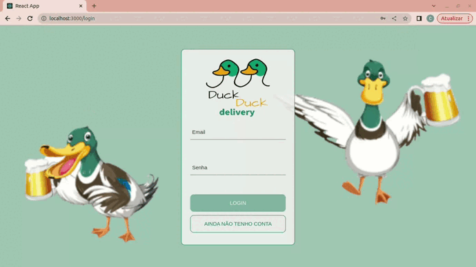

<!-- # :construction: under Construction :construction: -->
# App Delivery

<!-- PROJECT LOGO -->

  <h3 align="center">APP DELIVERY</h3>
    
 Sua Bebida a um click de distância

  
  

    
  

  
   
  
  

    <a href="https://project-delivery-app-blue.vercel.app/login"><strong>NAVEGUE NA VERSÃO DEMO WEB »</strong></a>
  

<!-- TABLE OF CONTENTS -->

  
Índice

  <ol>
    <li>
      <a href="#sobre-o-projeto">Sobre o Projeto</a>
      <ul>
        <li><a href="#construído-com">Construído com</a></li>
      </ul>
    </li>
    <li><a href="#uso">Uso</a></li>
    <li><a href="#contato">Contato</a></li>
  </ol>

<!-- ABOUT THE PROJECT -->
## Sobre o Projeto

Desenvolvemos uma plataforma Full-Stack de delivery de cerveja utilizando o ecossistema ReactJs e NodeJs!

Desenvolvido em equipe, o app consiste em uma aplicação full-Stack de um sistema de gerenciamento de uma distribuidora de bebidas. 
O layout teve como foco página web, então todos os protótipos vão estar desenvolvidos para monitor.

(<a href="#readme-top">Voltar ao Topo</a>)

### Construído com

* [![React][React.js]][React-url]
* [![React][Redux.js]][React-url]
* ![CSS]
* ![JavaScript]
* ![Node.js]
* ![Express.js]
* ![Sequelize]
* ![MySQL]

(<a href="#readme-top">Voltar ao topo</a>)

<!-- USAGE EXAMPLES -->
## Uso

Acesso via Login: tanto clientes como pessoas vendedoras e administrador do sistema, tem acesso ao aplicativo via login, porém para funções diferentes: (1) A pessoa cliente, que compra da lista de produtos; (2) A pessoa vendedora, que aprova, prepara e entrega; (3) A pessoa administradora, que gerencia quem usa o aplicativo;

É feita a comunicação de dados entre clientes e pessoas vendedoras: a pessoa cliente faz o pedido via "carrinho de compras" e a pessoa vendedora aprova, prepara e envia esse pedido. Quando o produto é recebido por quem comprou, essa pessoa marca o pedido como "recebido". Ambos possuem detalhes sobre seus pedidos;

Quando a pessoa cliente faz o pedido, o mesmo aparece para a pessoa vendedora em seu dashboard de pedidos após a atualização da página. A pessoa cliente, tem as informações sobre seu pedido quando sua página for atualizada, ou seja, ter informações se o pedido está sendo preparado ou se já saiu pra entrega;

O projeto pressupoe uma escalabilidade, dado que estabelecemos algumas entidades genéricas tanto para acesso ao banco de dados quanto na componentização das páginas no front-end.

(<a href="#readme-top">Voltar ao topo</a>)

<!-- CONTACT -->
## Contato

Edmilson Corrêa - edm.correa@hotmail.com

Link do Projeto: https://github.com/edmcorrea/project-delivery-app

(<a href="#readme-top">Voltar ao topo</a>)

<!-- MARKDOWN LINKS & IMAGES -->
[React.js]: https://img.shields.io/badge/React-20232A?style=for-the-badge&logo=react&logoColor=61DAFB
[Redux.js]: https://img.shields.io/badge/Context_API-663399?style=for-the-badge&logo=react&logoColor=white
[React-url]: https://reactjs.org/
[CSS]: https://img.shields.io/badge/CSS3-1572B6?style=for-the-badge&logo=css3&logoColor=white
[JavaScript]: https://img.shields.io/badge/JavaScript-F7DF1E?style=for-the-badge&logo=javascript&logoColor=black
[Node.js]: https://img.shields.io/badge/node.js-6DA55F?style=for-the-badge&logo=node.js&logoColor=white
[Express.js]: https://img.shields.io/badge/express.js-%23404d59.svg?style=for-the-badge&logo=express&logoColor=%2361DAFB
[Sequelize]: https://img.shields.io/badge/Sequelize-52B0E7?style=for-the-badge&logo=Sequelize&logoColor=white
[MySQL]: https://img.shields.io/badge/mysql-%2300f.svg?style=for-the-badge&logo=mysql&logoColor=white
